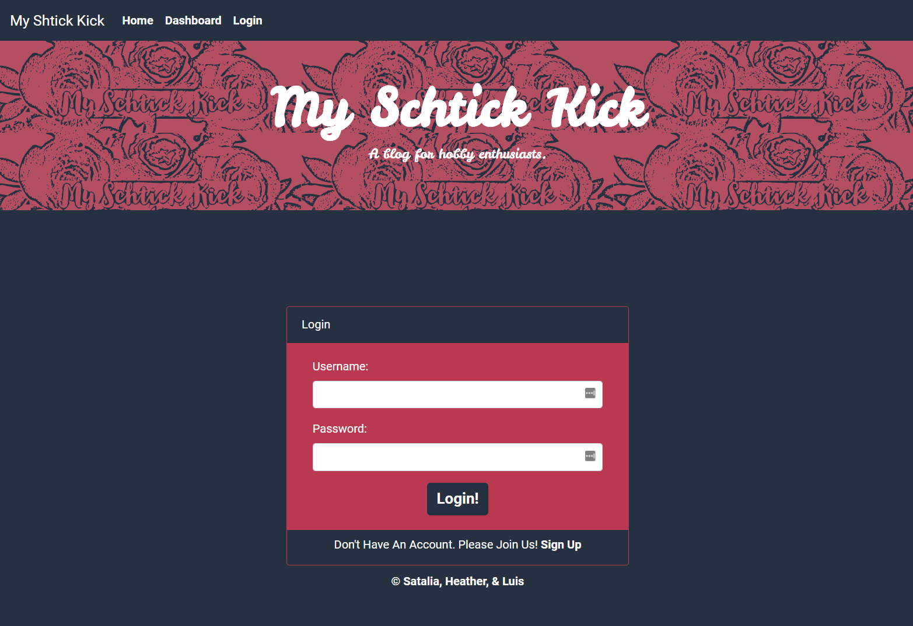
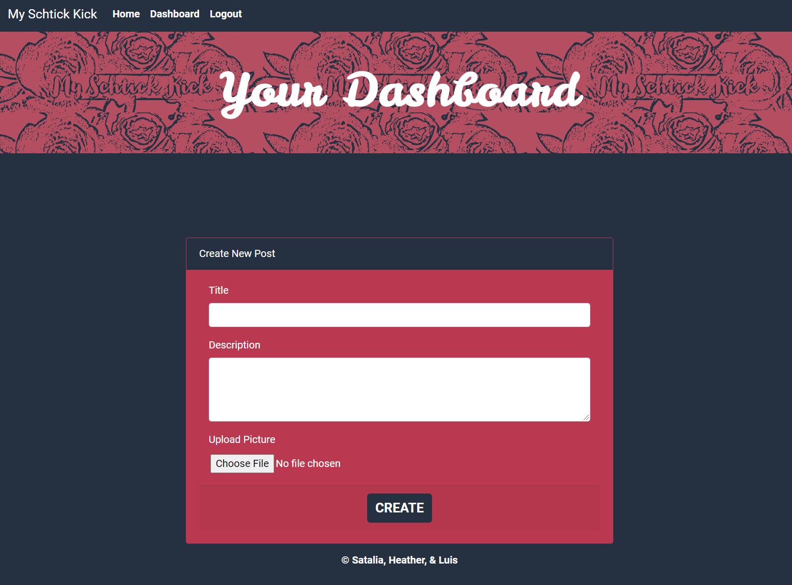

# My Schtick Kick

## A Blog For Hobby Enthusiasts

## USER STORY

* AS A hobby enthusiast who wants to share my hobby 
* I WANT a CMS-style blog site 
* SO THAT I can blog a description, and invite others who may be interested in my hobby to seek additional information 

## Requirements

* GIVEN a CMS-style blog site 
* WHEN I visit the site for the first time 
* THEN I am presented with the homepage, which includes existing blog posts if any have been posted; navigation links for the homepage and the dashboard; the option to log in and the option to contact the author of any blog
* WHEN I click on the homepage option 
* THEN I am taken to the homepage 
* WHEN I click on any other links in the navigation 
* THEN I am prompted to either sign up or sign in 
* WHEN I choose to sign up 
* THEN I am prompted to create a username , email and password 
* WHEN I click on the sign-up button 
* THEN my user credentials are saved and I am logged into the site 
* WHEN I revisit the site at a later time and choose to sign in 
* THEN I am prompted to enter my username and password 
* WHEN I click the contact me link
* THEN I am taken to a separate page where I can send an email to the email address of the link
* WHEN I am signed in to the site 
* THEN I see navigation links for the homepage, the dashboard, and the option to log out 
* WHEN I click on the homepage option in the navigation 
* THEN I am taken to the homepage and presented with existing blog posts that include the post title and the date created 
* WHEN I click on the dashboard option in the navigation 
* THEN I am taken to the dashboard and presented with any blog posts I have already created and the option to add a new blog post 
* WHEN I click on the button to add a new blog post 
* THEN I am prompted to enter a title and contents for my blog post and given the option to upload an image, if I choose to not upload an image, a placeholder image is uploaded  
* WHEN I click on the button to create a new blog post 
* THEN the title, contents, and image of my post are saved and I am taken back to an updated dashboard with my new blog post 
* WHEN I click on one of my existing posts in the dashboard 
* THEN I am able to update my post title and text, or delete my post and taken back to an updated dashboard 
* WHEN I click on the logout option in the navigation 
* THEN I am signed out of the site 
* WHEN I am idle on the page for more than a set time 
* THEN I am automatically signed out of the site 

### Screencastify (video of functionality)

https://drive.google.com/file/d/1HwVtEBzoMZkkHpSpSw6qwhQORwzKH4ya/view?usp=sharing

### Screenshots

 
 
 

### Heroku link

https://fathomless-waters-65385.herokuapp.com/

### Github repo

https://github.com/heatherzen/myschtickkick
